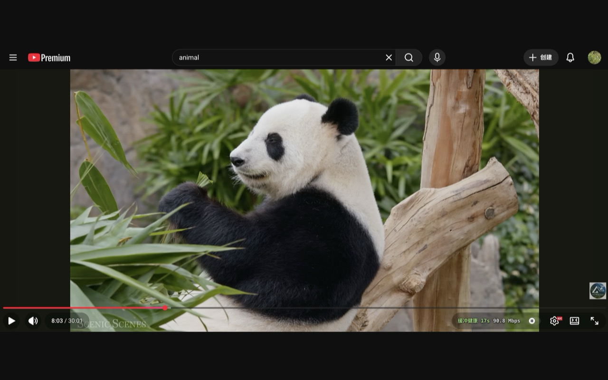
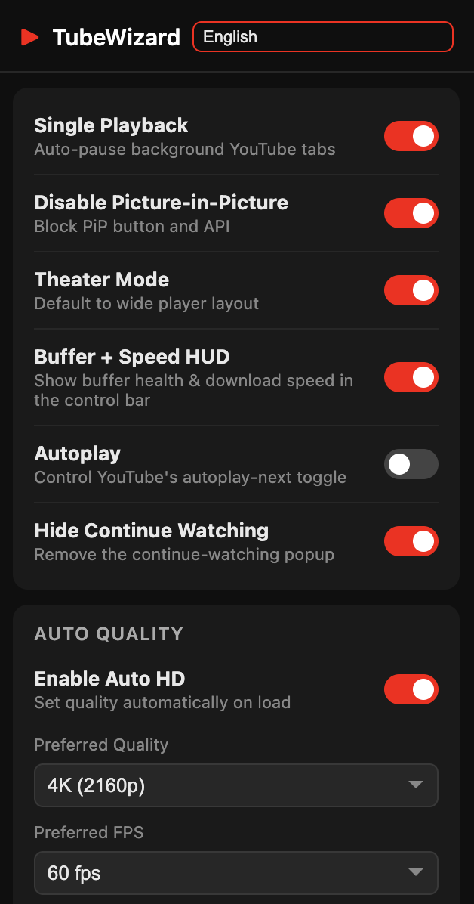

<div align="center">


# TubeWizard

**Power-ups for YouTube — single playback, auto HD/FPS, hide continue-watching, and more.**

`All local` · `zero data collection` · `no account needed`

**25 languages:** English · 简体中文 · 繁體中文 · 日本語 · 한국어 · Español · Français · Português · Bahasa Indonesia · العربية · فارسی · Kiswahili · Yorùbá · Igbo · বাংলা · עברית · हिन्दी · Italiano · Монгол · Nederlands · ਪੰਜਾਬੀ · Polski · Русский · Українська · Tiếng Việt

Language can be selected manually in the popup, or left on **Auto** to follow
Chrome's interface language (with English as the extension fallback).

</div>

---

<table>
  <tr>
    <td width="65%" valign="top">
      
      <p align="center"><sub>Auto HD + Buffer / Speed HUD on a watch page</sub></p>
    </td>
    <td width="35%" valign="top">
      
      <p align="center"><sub>One-click settings popup</sub></p>
    </td>
  </tr>
</table>

## Features

- **Single Playback** — Only one YouTube video plays across all your tabs. Open
  videos in background tabs without interrupting what you're watching. A video
  takes over only when you actively click play; switching to a non-YouTube tab
  keeps your current video going.
- **Auto HD + FPS** — Automatically set your preferred resolution (up to 8K/4320p)
  and frame rate on every video, with optional fallback to the next best quality.
- **Disable Picture-in-Picture** — Block the PiP button and the PiP API so
  videos never pop out unexpectedly.
- **Theater Mode** — Always start videos in the wide theater layout.
- **Autoplay control** — Mirror YouTube's "autoplay next" toggle to your preference,
  applied on every page.
- **Hide Continue Watching** — Remove the continue-watching mini-player popup
  that appears in the bottom-right corner when navigating away from a video.
- **Buffer + Speed HUD** — Optional live buffer health and download speed in the
  player control bar, with zero extra network usage.

## Install

<a href="https://chromewebstore.google.com/detail/tubewizard/faakolhpbnmoigcbikohccldhmagmflm">
  
</a>

[](https://chromewebstore.google.com/detail/tubewizard/faakolhpbnmoigcbikohccldhmagmflm)

[**Install from Chrome Web Store →**](https://chromewebstore.google.com/detail/tubewizard/faakolhpbnmoigcbikohccldhmagmflm)

## Install (development)

1. Open `chrome://extensions/`
2. Enable **Developer mode**
3. Click **Load unpacked** and select this folder

## Project structure

```
manifest.json              Manifest V3 config
src/background/            Service worker — single-playback coordination
src/content/content.js     Isolated-world bridge (chrome.* APIs)
src/content/inject.js      Main-world script (player API, quality, PiP, HUD)
src/popup/                 Settings popup
icons/                     Extension icons
docs/privacy.html          Privacy policy (GitHub Pages)
```

## Privacy

TubeWizard collects nothing. See the [Privacy Policy](https://yanjinbin.github.io/TubeWizard/privacy.html).

## License

[MIT](LICENSE)

---

_TubeWizard is an independent extension and is not affiliated with, endorsed by,
or sponsored by YouTube or Google LLC._
